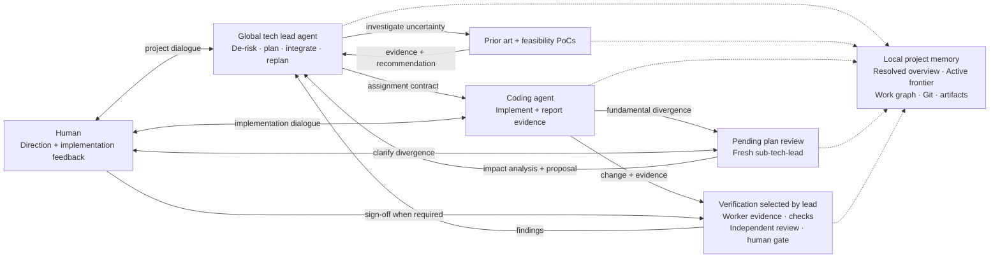
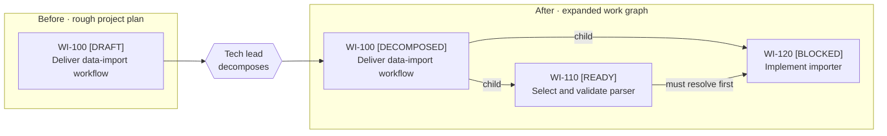
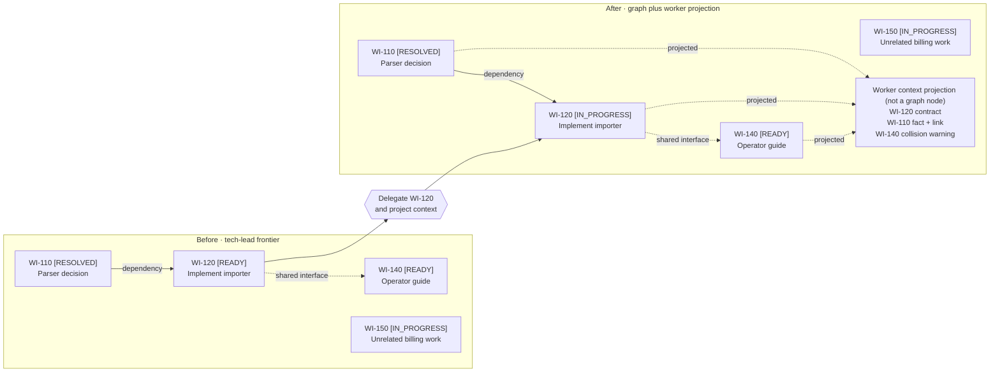
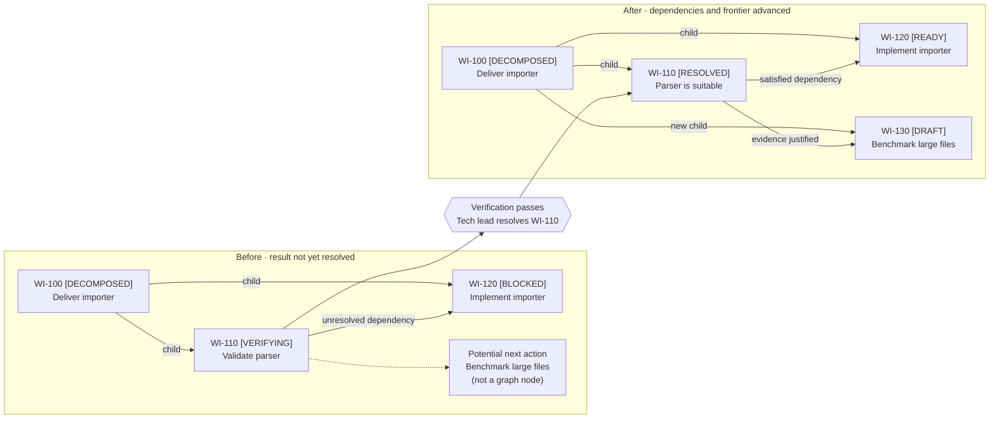
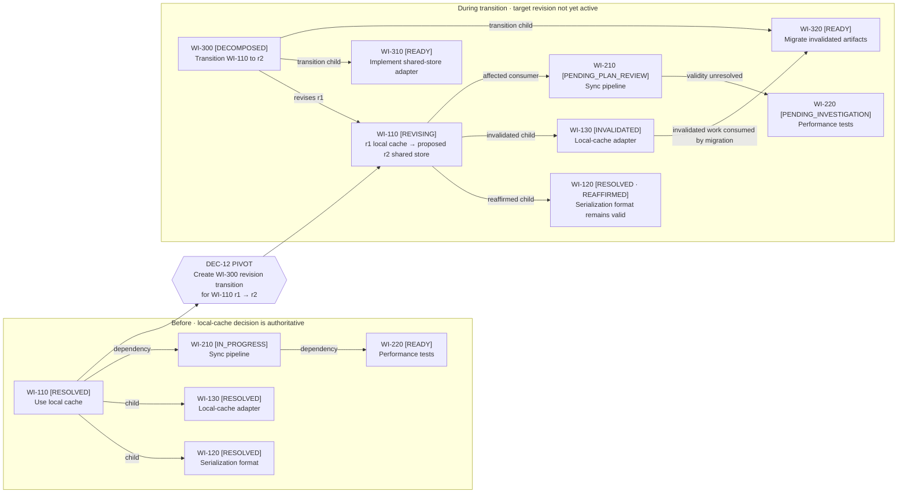

# Local Tech Lead Agent

*A local-first agent for long-running, ambiguous engineering work*

> **Status:** Vision  
> **Date:** 13 August 2026  
> **Audience:** Project contributors and early users

---

# Executive summary

This project explores a local tech lead agent that can carry an ambiguous engineering goal across many working sessions. It keeps the project intent coherent, expands the work into a dependency graph, delegates bounded assignments, evaluates evidence, adapts the graph, and asks the human for decisions when judgment or authority is required.

The first version is deliberately small. It runs in a local repository, uses files and Git as durable memory, and coordinates existing coding-agent sessions. It is not a hosted service, workflow platform, or distributed agent runtime.

The central idea is that long-running work needs more than a larger prompt. It needs a durable, risk-aware technical-management loop:

1. Maintain a current understanding of the goal, constraints, decisions, and unknowns.
2. Identify the assumptions most likely to invalidate the plan, research prior art, and test feasibility before committing to expensive choices.
3. Turn the resulting understanding into clear, independently resolvable work items that remain aligned with the whole project.
4. Let coding agents execute bounded assignments while surfacing discoveries and divergence.
5. Verify results against explicit acceptance criteria rather than trusting a claim of completion.
6. Revise the global plan when evidence or human direction changes the understanding of the problem.

The tech lead's prompt should optimize for reducing project risk, not merely for producing and completing work items. Progress includes disproving a weak architecture early, choosing an established solution over unnecessary custom work, and preventing a locally reasonable decision from harming the wider project.

> **Tech lead prompt priority:** Maintain the shared global view and choose the next action that most responsibly reduces project risk. Challenge high-level architecture with focused PoCs, research prior art before authorizing custom solutions, and evaluate local proposals by their project-wide consequences. Work-item throughput is not the same as project progress.

# 1. The problem

Coding agents work well on bounded assignments, but larger projects rarely remain bounded. Requirements are incomplete, discoveries invalidate earlier plans, work items depend on one another, and important context is scattered across conversations and implementation artifacts.

For a human technical lead, the hard part is not producing one plan. It is maintaining coherence while the plan changes:

- remembering why decisions were made;
- separating confirmed facts from assumptions;
- giving each contributor enough context without forwarding the entire history;
- recognizing when evidence contradicts the current design;
- deciding whether to retry, revise, decompose, or stop a work item;
- and knowing when a human decision is genuinely required.

The largest risks often appear before implementation quality becomes relevant. A high-level architecture may be infeasible, an apparently novel problem may already have a mature standard solution, or one worker may optimize its component at the expense of the system. The tech lead must actively retire these risks through research, comparison, prototypes, and a shared global view.

A single long-lived chat is a fragile answer to this problem. Context becomes noisy, sessions end, and conclusions are difficult to audit. The project needs durable state outside any one model session.

# 2. Vision

The tech lead agent acts as the continuing project mind while coding agents act as focused contributors. A human provides direction and retains authority over consequential product and engineering decisions. The local repository holds the shared record that allows any agent session to resume the work.



The human may interact with either the global tech lead or a worker. The worker is often the better conversational facade for implementation details because it has the freshest local context. However, a local conversation cannot silently redefine the assignment or broader project. Fundamental divergence triggers a project-level review before affected implementation continues.

The global tech lead agent is logically continuous, but it does not depend on one permanent conversation or process. A new session can reconstruct the current project position from concise, version-controlled files and recent evidence.

# 3. Goals and non-goals

## Goals

- Sustain engineering work across multiple sessions and interruptions.

- Turn ambiguous goals into an evolving plan with explicit assumptions and open questions.

- Reduce risk early through prior-art research, alternative analysis, and targeted feasibility PoCs.

- Maintain a shared global view so local assignment decisions account for project-wide consequences.

- Preserve an evidence-backed summary of resolved work and a separate, compact view of the work graph's active frontier.

- Delegate bounded work-item assignments to existing local coding-agent capabilities.

- Keep worker instructions self-contained and tied to clear acceptance criteria.

- Choose verification proportional to each acceptance criterion and require independent or human review where risk demands it.

- Preserve decisions, graph history, and project state in a form that humans can read and edit.

- Reconcile late pivots across resolved and active work without losing history or discarding unrelated valid implementation.

- Escalate decisions to the human at the right level, with context and a recommendation.

- Let humans work through either the tech lead or the implementation worker without losing plan coherence.

## Non-goals

- Building a hosted service, daemon, web application, or general-purpose workflow engine.

- Supporting distributed queues, remote worker fleets, multi-tenant projects, or high availability.

- Replacing the coding agent's own implementation loop, tools, or repository exploration.

- Removing the human from product, architecture, security, or destructive decisions.

- Guaranteeing correctness through model consensus or self-review alone.

- Designing production deployment, billing, identity, or infrastructure in the initial project.

# 4. Guiding principles

## Durable context, replaceable sessions

Project understanding lives in the repository, not only in a conversation. Agent sessions may be restarted without losing the current plan or the reasoning behind it.

## One coherent project view

The global tech lead agent maintains the authoritative project charter, an evidence-backed resolved overview, the active frontier, the risk picture, and the underlying work graph. The charter states the governing intent; the resolved overview states what the project has established; the frontier states what is being pursued now. Workers receive enough of that context to recognize cross-cutting effects. They propose code and report findings; they do not silently redefine project scope or mark their own work accepted.

## Reduce risk before committing

The tech lead treats important design choices as hypotheses until supported by evidence. Before committing significant implementation effort, it should identify failure modes, research prior art and common solutions, compare adopting or adapting them with building a custom solution, and run the smallest useful PoC for unresolved feasibility questions. The depth of research and validation should be proportional to the cost of being wrong.

## Prefer global outcomes over local optimization

A worker can make a locally sensible change that increases complexity, duplicates capability, constrains another work item, or undermines the overall architecture. The global tech lead evaluates discoveries and proposals against shared goals, dependencies, system boundaries, and cumulative risk before incorporating them into the graph.

## Current contract over accumulated conversation

Each worker receives a concise, self-contained assignment contract containing the current objective, relevant context, boundaries, and acceptance criteria. It should not need to reconstruct its assignment from a long chat history.

A worker session is bound to one revision of that contract and its relevant project-context snapshot. The contract defines the outcome and delegated authority; it does not freeze the worker's tactical execution plan. Conversation may refine that plan, but it does not silently revise the contract.

## Evidence before completion

A worker's “done” means ready for review. Resolution depends on the submitted change, checks, and explicit assessment against the work item's acceptance criteria.

## Replan when reality changes

Plans are hypotheses. New evidence may justify clarifying a work item, revising or decomposing it, changing dependencies, or reconsidering the project approach.

## Preserve history, revise validity

A resolved work item remains part of the historical record, but later evidence can invalidate its authority for current work. The tech lead uses dependency and provenance links to reassess downstream work, remove invalidated facts from the current project view, and reconcile repository artifacts while preserving still-valid results.

## Human conversation is input, not implicit authority

Humans may talk directly with any active agent. A worker can apply clarification and tactical changes that remain within its current contract. Direction that changes its intended outcome, acceptance boundary, governing design, fundamental assumptions, shared interfaces, dependencies, or another worker's assumptions must enter the global plan-review loop before implementation continues.

## Human-readable by default

The initial state format should favor Markdown, YAML, JSON, and Git. A human should be able to understand and repair the project state without specialized infrastructure.

## Bounded autonomy

The tech lead should continue safe, reversible work without unnecessary interruption. It should stop for missing authority, material scope choices, destructive actions, or unresolved contradictions.

# 5. Core workflow

## Understand

The tech lead turns the human's request into a project charter and separates governing intent from derived knowledge. It records the desired outcome, scope, constraints, and definition of done in the charter; known facts, assumptions, risks, and unresolved questions enter the appropriate evidence-backed project records.

## Research and de-risk

Before locking in a costly direction, the tech lead ranks risks by likelihood, impact, and cost to reverse. It researches established approaches and prior art, records credible alternatives, and uses focused spikes or PoCs to resolve questions that cannot be answered confidently from existing evidence. Research is decision-oriented: it should conclude with evidence, remaining uncertainty, and a recommendation.

Validation depth is selected from three qualitative factors: uncertainty in the current evidence, impact if the choice is wrong, and cost to reverse it later.

| Situation | Required action |
| --- | --- |
| Well-understood, local, and easily reversible | Implement and verify normally. |
| Established problem category but unclear solution choice | Research prior art and compare adopt, adapt, and build. |
| Feasibility depends on real behavior, integration, performance, or tool capability | Run a focused, time-boxed PoC or spike. |
| High-impact or expensive-to-reverse decision with meaningful uncertainty | Research, then PoC, then human review before dependent implementation. |

A risk blocks downstream implementation when being wrong could invalidate the architecture, cause substantial cross-item rework, commit the project to an unnecessary custom solution, affect shared interfaces or sensitive behavior, or eliminate an important future option. An uncertainty work item records its decision question, hypothesis, importance, cheapest useful evidence, success and failure signals, time box, and potential next steps.

Evidence is sufficient when it answers the decision question at confidence proportional to its impact, considers credible alternatives, is traceable or reproducible, and makes residual uncertainty explicit. The goal is not certainty; investigation stops when proceeding is more responsible than gathering more evidence.

## Maintain the project work graph

The project is the whole managed engineering effort. A **work item** is one node in its durable graph: a question to resolve, a design to produce, an implementation outcome, or an integration result. A **worker assignment** is a bounded execution of one ready work item. This terminology keeps the global project, its graph nodes, and individual agent sessions distinct.

The tech lead begins with a few rough, high-level work items and expands the graph incrementally as evidence makes the next structure knowable. Each ready item has a concrete objective, scope boundaries, inputs, acceptance criteria, relevant global constraints, and known risks. Over a long project, the graph may retain tens or hundreds of resolved, revised, replaced, and active nodes.

The graph records different relationships explicitly:

- decomposition links connect an outcome to the smaller work items needed to resolve it;
- dependency links state which resolutions or artifacts another item requires before it can proceed;
- revision and replacement links preserve changes in direction without rewriting history;
- related-context links identify decisions, research, interfaces, or concurrent work that may affect an item without blocking it.

Decomposition creates child nodes without erasing the parent that explains why they exist. An uncertain work item remains a leaf in the committed graph: possible follow-up work is recorded as potential next actions, not instantiated as children before the uncertainty is resolved. A well-understood implementation item may be decomposed when its objective and interfaces are stable. Decomposition stops when each child produces an output small enough to be reviewed and verified coherently; change size, files and interfaces touched, behavioral breadth, test surface, and reviewer cognitive load are proportional signals rather than fixed limits.

Each resolution records both what it relied on and what it changed: consumed work-item resolutions, governing assumptions, produced facts, affected artifacts, and relevant Git revisions. This provenance makes the graph useful not only for scheduling future work but also for finding the consequences of a decision that later changes.

This example shows the graph impact of decomposition. The original node remains as the durable statement of the higher-level outcome; the tech lead changes its state and adds only the children and dependency that are currently justified.



## Maintain the active frontier

The tech lead maintains a compact summary of the graph's active frontier in addition to the complete graph. The frontier contains every unresolved item that currently matters: work in progress, ready work, blockers, pending reviews, and near-term candidates whose creation depends on an expected resolution. It also records immediate dependencies, shared interfaces, collision risks, and the next graph decision.

The frontier is the project-level coordination view. The tech lead can access the context of all ongoing work and updates the frontier whenever a work item starts, blocks, changes, resolves, or unlocks another path. Individual workers do not receive all ongoing context by default. They receive the relevant frontier neighborhood—dependencies, dependents, shared constraints, and concurrent work that could conflict—while the full frontier remains available to the tech lead.

## Delegate a context projection

For a ready work item, the tech lead starts a focused coding-agent session with an assignment contract. The contract includes the work item's objective and acceptance criteria, its relevant project constraints, and the necessary slice of the frontier and graph. It does not include the complete graph or all historical context merely because those records exist.

The worker may plan tactically and explore the allowed codebase, but it remains responsible for one assignment. If it discovers that another active item or an earlier resolution is relevant, it can follow the supplied work-item IDs, search the project records, or ask the tech lead for a broader context projection.

Delegation changes the selected node from ready to in progress but does not copy or prune the canonical graph. The worker receives a projection containing the prerequisite fact and the active neighbor that shares an interface; unrelated work remains only in the tech lead's frontier.



## Execute and report

The worker executes the assignment in an isolated Git branch or worktree, runs relevant checks, and returns a structured summary of changes, evidence, uncertainties, blockers, and possible effects beyond its work item. The human may talk directly with the worker to clarify implementation or explore discoveries.

## Retrieve resolved context on demand

Resolved work remains searchable through the overview and stable graph links. Its detailed decisions, research, attempts, and evidence are not loaded into every worker session by default because accumulated history can crowd out the current assignment. A worker first receives concise established facts with provenance; when a fact needs interpretation or challenge, it can retrieve the linked resolution and then follow only the necessary predecessors. The tech lead may proactively include older context when it knows that a past decision or failure mode governs the new work.

## Handle divergence

The worker may revise its execution plan within the current assignment contract. Changing implementation structure, choosing a class instead of functions, reordering work, or improving how the implementation is tested does not require escalation when the objective, governing design, fundamental assumptions, constraints, and acceptance criteria remain intact. A worker may not silently weaken a verification method required by the contract.

Fundamental divergence occurs when human direction or implementation evidence changes or invalidates the work item's governing design decision, a fundamental assumption, its intended outcome, its acceptance boundary, or project context on which the contract depends. The worker then stops the affected work and enters `PENDING_PLAN_REVIEW`. It preserves useful work and records the divergence, evidence, and immediate impact instead of trying to reconcile a project-level change locally.

The worker hands the divergence to a fresh sub-tech-lead session rather than changing roles in place. That review receives a structured handoff plus the entire current project view—not only the worker's conversation—and works with the human to understand the desired change. It evaluates effects on architecture, risks, decisions, other work items, and completed evidence, then submits a coherent graph-change proposal to the global tech lead.

The global tech lead performs the final integration review and updates every affected graph node, contract, and frontier entry together. If the contract and its governing context remain unchanged, the existing worker session may resume. If either changes fundamentally, implementation continues in a fresh worker session. The work item may instead be decomposed, revised, replaced, or cancelled.

## Verify

The tech lead creates a verification plan from the work item's acceptance criteria and risk profile. The decision is automatic but criterion-specific: one work item may combine several verification methods.

| Method | Appropriate when | Required evidence or authority |
| --- | --- | --- |
| Worker-attested evidence | The criterion is low-risk, local, reversible, and independently repeating it would add little confidence. | Exact artifact, command result, screenshot, or other inspectable evidence; the worker does not grant acceptance. |
| Deterministic check | The criterion can be decided mechanically through a build, test, lint, type check, schema check, or reproducible command. | Result from the exact submitted artifact; rerun independently when provenance, hidden state, or regression risk matters. |
| Independent agent review | The criterion requires engineering judgment, cross-cutting analysis, interpretation of ambiguous requirements, or protection against the worker's local bias. | A fresh verifier receives the assignment contract, submitted artifact, repository guidance, and relevant global context, then reports criterion-level findings. |
| Human sign-off | The criterion depends on product intent, subjective quality, consequential tradeoffs, sensitive authority, or an explicitly protected decision. | An explicit recorded decision from the named human; sign-off does not override failed objective checks. |

Each criterion names its required method or methods in the assignment contract. The tech lead may escalate verification when implementation evidence reveals additional risk, but it may not silently weaken the plan after seeing an inconvenient result. A changed verification requirement is recorded as a work-item revision with rationale.

The tech lead records resolution only after every required method passes. When human sign-off is required, the work item remains pending until that decision is recorded. Worker-attested evidence can therefore be sufficient for selected criteria without allowing a worker to resolve its own assignment.

## Resolve and advance the graph

The global tech lead resolves the work item, requests a bounded correction, revises or decomposes it, or asks the human for a decision. Resolution is a graph event, not merely a status change. The lead records the supported facts and evidence, updates the resolved overview, and evaluates every outgoing dependency and potential next action.

A resolution may unblock existing work items, make provisional candidates concrete, reveal new work, invalidate another node, or complete a parent whose children now collectively satisfy its acceptance criteria. The tech lead applies those consequences together: it creates or revises the justified nodes, updates dependency links, removes completed branches from the active frontier, and refreshes the frontier with newly actionable work. No downstream item becomes ready solely because its expected predecessor produced output; the predecessor must be resolved with evidence sufficient for the dependency it supports.

This example shows the graph before and after a verified resolution. `WI-120` becomes ready only because its dependency is now satisfied. The potential benchmark becomes `WI-130` only after the result supplies enough evidence to justify committing it to the graph.



## Pivot and reconcile

A resolution is authoritative under the assumptions and project context recorded for that node revision, but it is not immutable truth. Later evidence or human direction may require a new revision of a previously resolved design after substantial dependent work has accumulated.

A pivot normally preserves the primary node's stable identity. The tech lead marks that node `REVISING`, suspends the old revision's authority for new dependency releases, and creates an ordinary **revision-transition work item** pointing back to it. That item receives its own worker assignment and session just like any other node. Its contract names the target node, its current revision, the intended new design, the affected graph neighborhood, and the verification required to activate the next revision. It records the migration work rather than hiding that work inside a metadata edit.

The revision-transition item can be decomposed like any other work item. Its children may investigate impact, migrate implementation, adapt interfaces, or reconcile repository artifacts. They can link directly to affected or invalidated nodes so the transition retains provenance from obsolete work to the change that handled it. The transition is complete only when its own acceptance criteria and all required child work pass; its resolution then creates and activates the primary node's next immutable revision. The primary node returns to `RESOLVED`, and the previous revision remains inspectable as superseded history.

An **invalidated work item** is a descendant or consumer whose own result is no longer applicable under the target revision. Invalidation is not deletion and does not rewrite history. The node remains in the graph with the reason, the primary revision transition that invalidated it, the scope of facts and artifacts that lost authority, and links to migration children that consumed or reconciled its work.

When a pivot is accepted, the tech lead performs an impact traversal through the revision-transition work item:

1. Record the pivot decision, mark the primary node `REVISING`, and create a transition item that targets its current revision.
2. Pause assignments whose governing context may have changed and block new work from relying on the superseded revision.
3. Traverse decomposition descendants, dependency consumers, and related-context or artifact links. Children are not invalidated merely because the primary node changed, and non-child consumers are not overlooked merely because they live on another branch.
4. Classify each affected node as reaffirmed for the target design, revision required, invalidated, or pending investigation. Record the rationale and exact relationship being reassessed.
5. Decompose the transition item when investigation, implementation migration, or artifact reconciliation requires independently verifiable work. Link those children to the affected nodes they handle.
6. Continue traversal through each newly invalidated node until no unreviewed downstream consumer remains.
7. Verify the reconstructed graph and workspace, resolve the transition item, and atomically publish the next revision of the primary node.

The traversal crosses both decomposition and dependency edges. The transition work makes the change itself visible in the same graph: one descendant can be reaffirmed, another invalidated and consumed by a migration child, and a non-child dependency consumer can require revision.



A still-applicable node is explicitly reaffirmed against the target design. A node requiring its own revision enters plan review and may receive a nested revision-transition item. An invalidated active assignment stops; an invalidated resolved node loses its authority as a current dependency even though its historical evidence remains inspectable. Any assignment whose contract changed starts in a fresh worker session.

Logical reconciliation and workspace reconciliation remain distinct responsibilities, but both belong to the revision-transition subproject. A migration child inventories affected artifacts and valid overlapping changes, then chooses among selective reversion, forward adaptation, replacement, or reconstruction. It must not blindly restore an old repository snapshot, because later valid work may share the same files or depend on unaffected portions of an invalidated node.

The pivot is reconciled only when every reachable affected node has a recorded disposition, current overview claims no longer rely on invalidated resolutions, the transition subproject is resolved, and the resulting workspace is verified against the reconstructed graph. Only then is the new primary revision authoritative and eligible to release dependents.

## Resume

At any later time, a new tech lead session reads the project charter, resolved overview, and active frontier first. It then opens only the referenced work-item nodes, decisions, risks, and evidence needed for the next action, and continues from the same logical position.

# 6. Local project memory

The durable state has three complementary layers: a stable project charter, two tech-lead summaries, and the canonical work graph. Supporting risk and decision indexes remain available without forcing the full history into every session.

| Record | Purpose |
| --- | --- |
| `CHARTER.md` | Human-authoritative intent: desired outcome, scope and non-goals, constraints, quality bar, protected decisions, and definition of done. |
| `OVERVIEW.md` | Compact, evidence-backed synthesis of what completed work has established, plus an index of resolved and later-invalidated work items. Every current project fact links to one or more verified, still-valid resolutions. |
| `FRONTIER.md` | Compact projection of the graph's unresolved edge: active, ready, blocked, pending-review, pivot-reconciliation, and immediately relevant parent or dependency items, with priorities and next actions. |
| `RISKS.md` | Authoritative register of active project-level and cross-cutting risks, their affected work items, mitigation or validation work, and disposition. |
| `DECISIONS.md` | Compact index of currently governing and superseded decisions, linked to the work-item resolutions that contain their evidence and rationale. |
| `work-items/<id>/` | Canonical graph node for one bounded question or outcome, with immutable contract revisions, execution attempts, verification, and eventual resolution or invalidation. |

## Charter versus overview

`CHARTER.md` and `OVERVIEW.md` answer different questions. The charter asks, “What are we trying to achieve, and what authority and constraints govern the effort?” The overview asks, “Given the work resolved so far, what is currently established about the project?”

The charter is primarily human-authored and changes only when intent, scope, constraints, or the definition of done changes. It must not contain implementation status, research conclusions, or derived architecture presented as immutable intent. The overview is tech-lead-maintained, changes whenever evidence is resolved or invalidated, and must not silently redefine the charter. If evidence suggests that the charter should change, the tech lead asks for or records the appropriate human decision before updating it.

## Work-item memory

A work-item directory has a small standard shape:

```text
work-items/<id>/
├── WORK.md
├── revisions/
│   └── <revision>.md
├── attempts/
│   └── <attempt>.md
├── verifications/
│   └── <verification>.md
├── resolutions/
│   └── <revision>.md        # present for each resolved revision
├── evidence/                 # optional non-code evidence
└── INVALIDATION.md           # present if later invalidated
```

`WORK.md` is the stable entry point. It contains the work-item ID and title, current state and active revision, objective, parent or decomposition links, dependencies and dependents, related-context and revision-transition links, current local assumptions and risks, affected artifacts, and pointers to the active contract and latest result. A transition item additionally records its target node and source revision. Relationship backlinks are updated together and may be checked mechanically so impact traversal does not require guessing which nodes consumed a resolution.

Each file under `revisions/` is an immutable node and assignment-contract snapshot containing objective, scope, context projection, acceptance criteria, verification requirements, and the governing assumptions to which a worker session was bound. Attempts and verifications name the exact revision they evaluate. `resolutions/<revision>.md` states what that revision established, which evidence supports it, what it consumed and produced, and which artifacts or decisions it affects. Multiple resolved revisions can therefore coexist without rewriting history. `INVALIDATION.md` records terminal loss of authority for the node, affected facts and artifacts, the governing primary-node transition, and migration children without modifying historical revisions or resolutions. A revision-transition item uses the same directory shape; its `WORK.md` names `target_node` and `from_revision`, and its resolution names the newly published target revision.

The optional `evidence/` directory is for durable evidence that does not naturally live in Git history or another repository artifact, such as benchmark output or a research comparison. Large generated output and chat transcripts are referenced rather than copied by default.

## Risk placement

`RISKS.md` is the single authoritative project risk register. It holds risks that could affect architecture, multiple work items, project outcomes, sequencing, or the cost of a pivot. Each entry has a stable risk ID and links to affected work items, evidence, mitigation or validation items, owner, status, and residual uncertainty.

A work item does not receive a separate `RISKS.md` by default. Its `WORK.md` and current contract include only the risks and assumptions relevant to executing that assignment, referencing global risk IDs where applicable. A worker reports newly discovered risks in its attempt record; the tech lead decides whether each remains local, is promoted to the project register, or justifies a new research or mitigation work item. When a risk is retired, its durable evidence belongs in the resolving work item while the root register records the disposition and link. If a local risk set becomes complex enough to need its own lifecycle, that is a signal to promote the risks or decompose the work item, not to create a second authoritative register.

`OVERVIEW.md` and `FRONTIER.md` remain separate even though a tech lead normally loads both. They have different truth semantics and update rates: the overview contains established knowledge and changes only when evidence is accepted or superseded, while the frontier contains provisional work and may change after every planning step. Keeping them separate prevents an active hypothesis from appearing to be a resolved fact and allows later sessions to load or refresh them independently.

The work-item directories are the source of truth for graph history. Every node receives its own stable ID directory under `work-items/`; decomposition, dependency, revision-transition, replacement, and related-context relationships are recorded as links between IDs. A flat ID namespace permits transition subprojects and links from migration children to invalidated nodes without forcing them into a misleading directory hierarchy. The summaries are tech-lead-maintained projections of this canonical graph, not substitutes for it.

When a work-item revision is resolved, `work-items/<id>/resolutions/<revision>.md` records the supported findings, evidence, consumed resolutions and assumptions, affected artifacts, and Git provenance. The tech lead updates `OVERVIEW.md` with the resulting project facts and links each claim to the responsible revision-specific resolution. If later work invalidates or supersedes a fact, the overview removes it from the current synthesis or marks it as no longer valid, points to the primary node's revision transition and active revision, and retains the earlier basis in the historical resolution index. Invalidated facts must not remain phrased as current project truth.

`FRONTIER.md` answers what is happening now: the current goals in motion, their status, immediate dependencies, blockers, revisions under review, revision-transition subprojects, and next decisions or actions. Resolved branches fall out of the frontier after their conclusions are incorporated into the overview, but reappear when a transition puts their validity or artifacts under reconciliation. The full graph therefore may grow large while both summaries remain suitable for a fresh tech-lead context.

Git provides the chronological activity history and ties implementation and project-state changes to concrete revisions. Separate activity or transcript logs should not be added unless the resumption experiment shows that Git plus these records is insufficient. Chat transcripts are supporting context, not a source of truth.

The sufficiency test is behavioral: after reading `CHARTER.md`, `OVERVIEW.md`, and `FRONTIER.md`, a fresh tech-lead session must be able to explain what the project is trying to achieve, what completed work has established and why those facts are trustworthy, what is happening now, which risks could invalidate the plan, and what should happen next. It may follow work-item links for detail, but it should not need to scan the full graph before acting.

## State ownership

The global tech lead agent maintains the majority of the authoritative `.techlead/` records. In particular, it owns `OVERVIEW.md` and `FRONTIER.md`: it integrates accepted evidence into the resolved view, advances the active frontier, updates risks and decisions, creates or revises graph nodes, and records state transitions. Centralizing this responsibility is how the project preserves one coherent global view instead of accumulating incompatible local interpretations.

Workers, researchers, sub-tech-leads, and verifiers provide structured assignment-scoped inputs: implementation summaries, evidence, discoveries, divergence analyses, and verification findings. They may create clearly identified result artifacts, but they do not independently rewrite broader project state or treat their reports as accepted conclusions. The global tech lead evaluates and incorporates their results into every affected record.

Local automation should remain mechanical in the PoC. It may capture timestamps, Git revisions, changed files, command results, and validate record structure. It may propose an update, but judgment-bearing changes—such as resolving a work item, changing risk severity, revising a decision, or altering the work graph—remain tech-lead actions. Human edits remain authoritative input; the tech lead detects and reconciles them before continuing.

## Work-item lifecycle

The PoC only needs a small set of states. The before-and-after workflow diagrams above show the important transitions in context; this table defines the vocabulary without presenting it as one universal linear path.

| State | Meaning |
| --- | --- |
| `DRAFT` | Proposed graph node whose contract is not ready. |
| `READY` | Contract is actionable and dependencies are satisfied. |
| `DECOMPOSED` | Parent is being resolved through child work items. |
| `IN_PROGRESS` | A worker assignment is active. |
| `BLOCKED` | A required dependency, decision, or authority is missing. |
| `SUBMITTED` | Worker result and evidence are ready for verification. |
| `VERIFYING` | Required verification methods are running. |
| `NEEDS_CHANGES` | Verification found a bounded correction. |
| `PENDING_HUMAN` | An explicit human decision or sign-off is required. |
| `PENDING_PLAN_REVIEW` | Governing context may have changed and the graph must be reviewed. |
| `REVISING` | A resolved primary node has suspended its current revision while a linked transition item produces and verifies the next revision. |
| `RESOLVED` | Acceptance criteria passed and the resolution may support dependents. |
| `REPLACED` | Another node now represents the intended work. |
| `INVALIDATED` | The node remains historical but no longer has authority for current work. |

A decomposed parent remains unresolved while its children are active. Resolved child items provide evidence toward the parent's objective, but the parent becomes resolved only after the tech lead synthesizes their resolutions and verifies the parent's own acceptance criteria. This preserves the reasoning path from an early rough item to the concrete work that ultimately resolved it.

A work item whose design, objective, or acceptance criteria materially changes gets a new revision. If that node was already resolved or has dependent work, a linked revision-transition item performs the change and publishes the new revision only after verification. The transition item may be decomposed and its children may link to invalidated descendants whose artifacts or facts they migrate. When a revision would obscure a fundamentally different identity or outcome, the tech lead may still create a replacement item, but ordinary pivots preserve the primary node ID. A broader change also triggers review of the charter, overview, frontier, risks, dependencies, and other assignment contracts. Historical results remain attached to the revision that produced them.

`INVALIDATED` is a historical terminal state for a node whose own outcome no longer applies: it does not return to ready or resolved. Still-useful portions are consumed by explicitly linked revision-transition children or, for a genuinely different outcome, a replacement item. The pivoted primary node itself normally uses `REVISING` and gains a new revision instead of becoming invalidated.

## Portable agent roles and repository context

The tech lead, worker, and verifier are distributed together as reusable role skills. Small Codex- and Claude-specific adapters configure tool access, isolation, and invocation, and are installed once for a user rather than copied into every project.

A role defines instructions, responsibilities, and delegated authority. An agent is a model operating under a role that observes context and decides whether to investigate, act, verify, ask, continue, or stop. A session is one context-bound execution history of that agent. The coding-agent harness supplies the execution loop, tools, permission enforcement, persistence, and human-interaction channel. A worker session is therefore a concrete run of a worker agent inside a harness, not the harness itself.

Each target repository owns only its guidance and project state. `AGENTS.md` contains shared repository conventions and a small tech-lead bootstrap. `CLAUDE.md` imports that guidance and adds only necessary Claude-specific instructions. A tech-lead session normally loads both `OVERVIEW.md` and `FRONTIER.md`, then follows work-item links as needed. A worker or verifier receives only the relevant portions. An agent's effective context combines its distributed role, repository guidance, selected `.techlead/` records, and current assignment contract.

The interactive parent session normally acts as the global tech lead. It starts a fresh worker or verifier through the host's native adapter and passes an explicit context manifest naming the repository root, pinned revision or worktree, relevant project records, and exact assignment contract. Automatic repository-guidance discovery complements this manifest but does not replace it. Fresh agents are never expected to reconstruct their assignment from the parent's conversation.

## Session continuity

A worker session is valid for one assignment-contract revision and the governing context on which that contract depends. It may continue through tactical steering and changes to its own execution plan. Examples include answering an implementation question, correcting execution, selecting classes or functions, reordering steps, and changing the tests used to establish the same required behavior.

A fundamental change to the work item's objective, acceptance boundary, governing design decision, foundational assumptions, or dependent project context requires plan review and then a fresh worker session with a new context manifest. This prevents superseded assumptions from competing with the current source of truth without discarding useful implementation continuity for ordinary tactical changes. The handoff records which revision superseded the old one and what existing implementation evidence remains valid.

Session replacement and artifact replacement are separate decisions. A fresh worker may continue from the existing branch or worktree when its changes remain valid and inspectable under the revised contract. The tech lead requests a clean or selectively reverted workspace only when existing artifacts would bias, conflict with, or obscure the revised work.

# 7. Human collaboration

The human can interact with the global tech lead for project-level direction or with a worker for implementation-level discussion. The worker is often the better facade for detailed collaboration because it can connect questions directly to the code, current approach, and immediate evidence. The global tech lead remains responsible for integrating changes across the project.

Both roles should behave like technical leads, not notification routers. They gather low-level findings, identify the decision they imply, and ask the human a concise question with relevant tradeoffs and a recommendation.

Direct worker interaction follows one boundary:

- A clarification or tactical change that preserves the current objective, acceptance criteria, governing design, and fundamental assumptions can be incorporated by the worker. Its implementation and testing plan may evolve without escalation.

- A fundamental divergence puts the work item into `PENDING_PLAN_REVIEW`. The worker prepares a structured handoff, and a fresh sub-tech-lead session loads the global project context and produces an impact-aware graph proposal.

- Only after the global tech lead reconciles that proposal with the entire project may affected implementation continue. An unchanged contract returns to the existing worker; a fundamentally changed contract or governing context starts a fresh worker session.

Human input is expected when:

- the desired product behavior is ambiguous in a consequential way;
- scope, schedule, quality, or compatibility goals conflict;
- an architectural choice has meaningful long-term cost;
- credentials, external communication, destructive changes, or other authority are required;
- or the available evidence does not support a responsible decision.

The agent should not interrupt the human for recoverable test failures, ordinary implementation choices within an assignment, or questions that repository evidence can answer.

## Harness-mediated checkpoints

The PoC does not implement a separate checkpoint engine. The active agent decides when semantic uncertainty or missing authority prevents responsible progress. The selected coding-agent harness—such as Codex or Claude Code—provides the mechanism to pause execution, ask the human, and resume the session, and it independently enforces tool and permission boundaries.

The tech lead steers that behavior through its role instructions, the project charter, and each assignment contract. These inputs describe the preferred autonomy level, decisions the agent should escalate, actions requiring authority, and any acceptance criterion that explicitly requires human sign-off. Workers receive the relevant preferences with their contracts.

Agent judgment handles ordinary semantic checkpoints, while the harness mediates interaction and mechanical approvals; recorded project gates remain authoritative. Neither the worker nor the harness may waive an explicit human sign-off, alter the assignment contract, or resolve a work item on the human's behalf. Answers that fundamentally diverge from the contract follow the normal divergence workflow.

# 8. Proof-of-concept scope

The PoC should prove that the complete workflow is useful on one real local project. It is successful if the agent can maintain coherence through ambiguity and change—not merely if it can dispatch several coding sessions.

## In scope

- One local repository and one active project.

- One tech lead agent operating across replaceable sessions.

- An incrementally expanded work graph stored as stable work-item-ID directories, with decomposition, dependency, revision-transition, replacement, and related-context links.

- A separate resolved overview and active frontier, both maintained by the tech lead, alongside an explicit risk and research log.

- Evidence links from every substantive fact in the resolved overview to a verified work-item resolution.

- Prior-art research and a focused feasibility PoC for at least one consequential design assumption.

- Existing local coding-agent sessions used as workers.

- One worker assignment at a time, using a Git branch or worktree.

- Self-contained assignment contracts and structured worker results.

- Criterion-level verification plans supporting worker-attested evidence, deterministic checks, independent agent review, and human sign-off.

- Explicit assumptions, decisions, open questions, and work-item revisions.

- Human interaction through both the global tech lead and an implementation worker.

- A fundamental worker-level divergence that triggers pending state, fresh sub-tech-lead review, and global plan reconciliation.

- A pivot that moves a previously resolved primary node to a new revision after both resolved and active work have depended on its earlier revision.

- A revision-transition item that traverses affected descendants and consumers, decomposes into migration work, links to invalidated subnodes, reconstructs the valid graph, and publishes the primary node's new revision.

- Restarting the tech lead session and resuming from repository state.

## Out of scope

- A background service or always-running process.

- Parallel scheduling, remote execution, databases, queues, or cloud storage.

- A graphical interface or generalized plugin ecosystem.

- A custom checkpoint scheduler, approval interface, or replacement for the coding harness's native human-interaction behavior.

- Production-grade sandboxing, access control, secrets management, or observability.

- Automatic merging, deployment, or other external side effects.

- Blindly rolling the repository back to an earlier snapshot solely because a graph node was invalidated.

- Optimization for many projects, teams, or agent providers.

## Demonstration scenario

Use a real change that begins as a few rough work items, expands at least one of them into concrete children, and includes architectural or solution uncertainty. Research prior art and test one important feasibility assumption before committing to the main implementation. Exercise worker-attested evidence, a deterministic check, independent agent review, and an explicit human sign-off across the resulting acceptance criteria. After the governing primary node is resolved and at least one consumer has also resolved while another is active, introduce evidence or human direction that pivots its design. The system marks the primary node `REVISING`, creates a revision-transition item, pauses affected work, reviews descendants and dependency consumers, reaffirms valid nodes, invalidates obsolete nodes, and decomposes the transition into verified migration and artifact-reconciliation work linked to those obsolete nodes. Completing the transition publishes the primary node's next revision. Complete the project without relying on the original tech-lead conversation or manually reconstructing historical context.

## Exit criteria

- A fresh tech lead session can explain the governing intent, established project state, and active work after reading `CHARTER.md`, `OVERVIEW.md`, and `FRONTIER.md`, opening linked work-item directories only when detail is needed.

- Every current project fact in `OVERVIEW.md` links to a verified, still-valid work-item resolution, and every resolved or later-invalidated item appears in its historical resolution index.

- `FRONTIER.md` agrees with the unresolved edge of the canonical work graph and excludes completed branches after their conclusions are incorporated into the overview unless a pivot has reopened them for reconciliation.

- A consequential architecture or build-versus-adopt decision cites prior art, alternatives, and feasibility evidence proportional to its risk.

- Every delegated assignment has a self-contained contract and an evidence-bearing result.

- Every acceptance criterion names its required verification method, and the final record shows that each requirement was satisfied by the correct authority.

- At least one work item is revised, decomposed, or replaced in response to new evidence.

- A pivot of a resolved primary node creates a linked revision-transition item that reaches every decomposition descendant and dependency consumer; each affected node records a reaffirmed, revision-required, invalidated, or pending-investigation disposition.

- No current overview claim or ready dependency relies on an invalidated resolution.

- The transition subproject removes or adapts invalidated artifacts while preserving overlapping valid work; after verification, its resolution publishes the primary node's next revision.

- An instruction that changes a worker's governing design or fundamental assumptions cannot silently alter its contract: the assignment pauses, a fresh sub-tech-lead reviews the global impact, and all affected graph nodes are updated together.

- No work item is resolved solely because its worker says the assignment is complete.

- The final outcome is traceable to resolved work items, verification results, and relevant decisions.

- The human reports that the agent reduced coordination effort without obscuring control or project understanding.

# 9. Measures of success

The project should optimize for coordination quality rather than agent activity. Useful measures include:

- how accurately a new session resumes the project;
- whether overview claims remain traceable to verified work-item resolutions;
- whether the frontier remains a concise and accurate projection of unresolved work;
- how many high-impact assumptions are retired before substantial implementation;
- whether architecture and build-versus-adopt decisions use relevant prior art and evidence;
- how often assignment contracts need clarification after delegation;
- whether acceptance criteria are covered by evidence;
- how often verification catches substantive issues;
- how much completed work is invalidated by late discoveries;
- whether worker-level discoveries and human changes are propagated to every affected work item;
- whether pivot impact traversal finds all downstream consumers without unnecessarily invalidating still-applicable work;
- how much valid work is preserved during workspace reconciliation;
- the number and quality of human interruptions;
- and whether the maintained plan remains understandable to the human.

Speed and token usage matter, but they are secondary to completing the right work while preserving trust.

# 10. Future direction

If the local workflow proves valuable, later versions may coordinate more work at once, add richer checks, and reuse project patterns. Those are possible evolutions, not assumptions embedded in the first design.

The local project memory and interaction contracts should remain simple enough to evolve without changing the core workflow or the human experience.

> **Bottom line:** Start with one local tech lead agent, one repository, an evidence-backed resolved overview, a compact active frontier, a durable work graph, and existing coding agents. Prove that the loop can carry an ambiguous project across sessions—research, de-risk, expand, delegate, verify, learn, and globally replan—before considering infrastructure around it.
