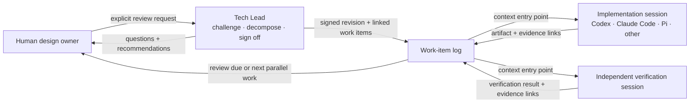
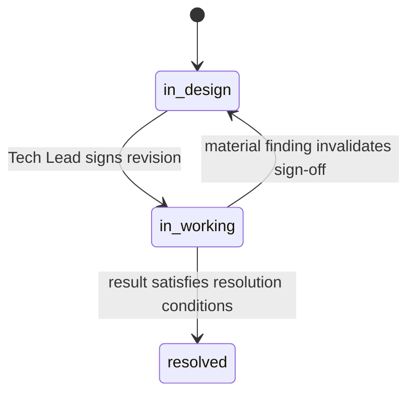

# Tech Lead: Design Review and Work-Item Log

*A local-first design bar-raiser for human-led engineering work*

> **Status:** Vision
> **Date:** 16 September 2026
> **Audience:** Project contributors and early users

---

# Executive summary

The Tech Lead agent is an explicitly invoked reviewer for engineering design
documents and a durable manager of the work items derived from them. It helps a
human lead the design; it does not take over the project.

Its two responsibilities are:

1. **Raise the design bar.** Adversarially review a design document, expose its
   explicit and implicit assumptions, propose material alternatives—including
   non-obvious ones—and ensure the work is decomposed into independently
   actionable items with verifiable outputs.
2. **Maintain the work-item log.** Preserve sign-offs, relationships, results,
   evidence, and resumable agent-session references so the human can ask what to
   do next and receive one or more safe parallel options.

The Tech Lead participates only when the human explicitly invokes one of those
responsibilities. It does not implement a design, launch or supervise workers,
verify an implementation, or make implementation and verification depend on a
Tech Lead session. The human may use Codex, Claude Code, Pi, another agent, or no
agent at all. Those tools return results to the work-item log when the human
wants the record updated.

> **Tech Lead prompt priority:** Challenge the design without taking ownership
> away from its human author. Sign off only when assumptions, material
> alternatives, requirements, decomposition, and verifiable outcomes are clear.
> Keep the resulting work easy to enter, resume, and reason about.

# 1. The problem

Engineering design reviews fail in two opposite ways.

An agreeable reviewer accepts the proposed framing, overlooks implicit
assumptions, and produces implementation tasks that sound plausible but cannot
be verified. A controlling reviewer turns the discussion into its own project,
spends the interaction maintaining process state, and makes the human feel as
if they are no longer leading the design.

Long-running work adds a second problem. Design context becomes scattered among
documents, work-item descriptions, agent sessions, implementation artifacts,
and verification results. A later agent can see *what* to do but not *why*, or
the log recommends work that another session has already started.

The project needs a smaller role with a sharper boundary: a demanding design
reviewer when invited, and a useful work-item record when asked. It should make
the human's reasoning stronger without becoming the implementation control
plane.

# 2. Vision

The human authors and owns the design. The Tech Lead challenges it, records the
decisions made during review, and signs off whether the document has cleared the
review bar. External tools implement or verify the resulting work independently.
Their evidence returns to the work-item log, where it can resolve items or
trigger a new design review.



The Tech Lead is not a continuously running global project mind. Its continuity
comes from human-readable repository records. A fresh Tech Lead, implementation,
or verification session should be able to start from a work-item folder and
follow file links to the exact context it needs.

# 3. Scope and authority

## The human owns

- The design document and its intended outcome.
- Product intent, constraints, and consequential engineering choices.
- Acceptance or rejection of assumptions and alternatives.
- The choice of implementation and verification tools.
- Whether Tech Lead is invoked and which document or work item it reviews.

Tech Lead may propose or draft changes, but it edits the design document only
when the human explicitly asks it to.

## Tech Lead owns

- The design-review process and review bar.
- The decision that an item moves from `in-design` to `in-working`.
- Immutable sign-off revisions and current open review findings.
- Work-item identity, relationships, context links, and lifecycle state.
- Recording externally supplied results and their design implications.
- Recursive parent roll-up and scheduling required follow-up reviews.
- Recommending the next one or more compatible work items.

## External implementers and verifiers own

- Tactical implementation decisions within the signed design.
- Changes to implementation artifacts.
- Implementation checks and evidence.
- Independent evaluation of correctness.
- Reporting outcomes, uncertainties, and contradictions with links to evidence.

Tech Lead may check that a promised artifact and evidence reference are present.
It does not turn that bookkeeping check into an independent correctness claim.
An implementation item is resolved from an explicit external result; a
verification item's result remains the verifier's judgment.

## Explicit activation

Ordinary design or implementation conversation does not silently activate Tech
Lead. The human explicitly chooses one of three capabilities:

- **Review work:** Review a named item according to its current state. This is
  the only capability that signs a baseline, records and judges a supplied
  outcome, resolves an item, or returns an `in-working` item to `in-design`.
- **Create a work item:** Create a named child from one explicit parent and link
  its inherited context.
- **Manage the work log:** Show status, recommend next work, attach a workspace,
  register or update sessions, or validate state without transitioning an item.

Codex exposes these concisely as `$review-work`, `$create-work-item`, and
`$work-log`. Other hosts preserve the same capabilities through their native
invocation conventions.

Creating an item always initializes it as `in-design` with no active revision
and no pending re-review flag. Creation does not inherit the parent's sign-off
or approve the new item. Only an explicit review of that child can establish
its first signed baseline and move it to `in-working`. A resolved parent cannot
receive a new child.

# 4. Design-review bar

## Adversarial, not antagonistic

Tech Lead builds a decision tree from the document and project context. It
resolves prerequisite decisions before downstream ones, gives a recommended
answer for every material question, and continues until the human confirms
shared understanding.

The review behavior is built into Tech Lead. A separately installed grilling
skill may help implement the interaction, but the product must not depend on an
external skill or a particular version of one.

## Assumptions

Tech Lead identifies both explicit and implicit assumptions. Each material
assumption must end with one of these dispositions:

- **Accepted:** the human knowingly accepts it and the residual risk.
- **Verified:** existing linked evidence supports it.
- **Assigned:** a child work item will test it before dependent work proceeds.
- **Removed:** the design changes so that the assumption is no longer required.

An assumption cannot disappear merely because the conversation moved on.

## Alternatives

Tech Lead uses out-of-the-box but context-constrained reasoning to identify
approaches the document did not consider. It must cover every **material
credible alternative**: an approach that could substantially improve the
outcome, reduce risk or complexity, or invalidate the proposed architecture.
It does not enumerate every imaginable variation.

Each material alternative must be:

- accepted into the design;
- explicitly rejected by the human with rationale; or
- deferred to an exploration work item.

For each alternative, Tech Lead explains its advantage, cost, and the assumption
that separates it from the proposed design.

## Decomposition

A design passes only when its required child work is coherent. Tech Lead must
be able to identify and review the following aspects for each child, whether
they appear directly in free-form `WORK.md` prose or in linked context:

- the requirement or question it owns;
- relevant scope boundaries and inherited constraints;
- inputs and plain-language start conditions;
- the artifact, evidence, or decision it will produce;
- objective resolution conditions; and
- context links needed by a fresh agent session.

Children should be independently actionable and verifiable. Decomposition is
not a demand for tiny tasks; it stops when each output can be understood and
evaluated without reconstructing the entire project.

## Sign-off

Tech Lead moves an item from `in-design` to `in-working` only when:

- all material assumptions have an explicit disposition;
- all material credible alternatives have an explicit disposition;
- requirements, boundaries, start conditions, and outputs are clear;
- resolution conditions are verifiable; and
- the required child set is coherent and independently actionable.

The human owns the decisions. Tech Lead owns whether those decisions and the
resulting document meet the bar. Once the human has dispositioned all protected
decisions, Tech Lead does not need a second human approval merely to record its
sign-off.

# 5. Work-item model

## Kinds

The initial model uses four work-item kinds:

| Kind | Intended output |
| --- | --- |
| `design` | A reviewed design or higher-level outcome. |
| `exploration` | Evidence for an assumption or alternative, such as research or a PoC. |
| `implementation` | A specified implementation artifact or behavior. |
| `verification` | An independent assessment of an implementation or claim. |

`exploration` is optional. Routine reasoning stays in the design review; a
separate exploration item is useful only when producing the evidence requires
substantive work that should be scheduled and recorded.

## Lifecycle

Every work item uses the same three states:

| State | Meaning |
| --- | --- |
| `in-design` | The item has not passed the current review bar, or its previous sign-off no longer governs. |
| `in-working` | Tech Lead has signed off the current revision. The item or its required children may proceed. |
| `resolved` | Every child is resolved, the required outcome is recorded with evidence, and the completion review has passed. This state is terminal. |

`in-working` means the design is signed off; it does not imply that a particular
agent is currently executing it. Active sessions are separate metadata.
Sibling coordination also does not require extra lifecycle states or formal
graph edges. An `in-working` leaf is actionable only when its signed
plain-language start conditions are satisfied and no review is pending.



A resolved item never returns to `in-working` or `in-design`, and no new child
may be created beneath it. Later discoveries become new work under the nearest
appropriate unresolved ancestor, with the resolved item linked as context. If
the root is resolved, the follow-up starts a new Tech Lead project and links the
closed project rather than rewriting its history.

## Parent roll-up

Resolving a child immediately updates its parent with a linked summary of the
result. A resolved child does not erase the parent's bar-raising sign-off, and a
parent does not resolve merely because one child finished.

There are two parent-review triggers:

1. **Early exception review.** A child explicitly reports evidence that
   materially contradicts an accepted parent assumption or signed design. The
   affected parent records `review_required: true`, and no new affected work is
   recommended until the review occurs. The explicit review either reaffirms the
   current revision or returns the parent to `in-design`. Tech Lead identifies
   potentially affected active work but does not cancel or modify external
   implementation sessions.
2. **Completion review.** All children required by the signed revision are
   resolved. The parent records `review_required: true` and remains
   `in-working` until the human explicitly invokes Tech Lead review.

The completion review considers the child results together. Tech Lead then:

- marks the parent `resolved` when they collectively satisfy its outcome;
- keeps the current revision when the findings reaffirm its semantic baseline;
- proposes additional child work when the baseline needs it, creates those
  children only after explicit human confirmation, then signs the new parent
  revision and keeps it `in-working`; or
- returns it to `in-design` when the findings require design revision.

Children approved inside a review are created through the normal creation
operation and always begin `in-design`. Their creation and the parent revision
form one atomic mutation. If the human does not approve creation, the parent
remains `in-working` with `review_required: true`.

Review requirements are queued in the durable log; they do not autonomously
start a Tech Lead session.

# 6. Durable repository record

## Portable project and workspace identity

A human-chosen control root may host multiple descriptively named Tech Lead
project directories. Each project directory is the canonical log root and has
a UUID `project_id`; it does not contain another nested `.techlead/`. Each
attached implementation repository has one stable `workspace_id`, shared by
its clones and worktrees when the locator is copied or tracked. Its portable
locator may bind that workspace to more than one Tech Lead project without
storing any local path:

```text
techlead-control/
├── session-platform-modernization/
│   ├── PROJECT.md
│   ├── work-items/
│   ├── sessions/
│   ├── local/
│   └── workspace-links/
└── payment-reliability/
    └── ...
```

```yaml
---
workspace_id: service-a
project_ids:
  - 8d96a5d7-4127-4ef5-a3da-32ea927d951f
  - 3a78c921-b65f-4e93-853d-53a49bf36e84
---
```

An ignored `.techlead` symlink selects the attached project separately in each
worktree, so worktrees of the same repository may participate in different
projects. If multiple bindings exist and no local selection or explicit project
is supplied, Tech Lead asks the human rather than guessing. Machine-local paths,
symlinks, and generated snapshots are never committed.

A single provider-neutral per-user registry maps project UUIDs to their current
project-directory paths for both Codex and Claude. `init` populates it;
`attach --control-dir <path>` discovers and registers projects on another
machine. The resolver verifies each target `PROJECT.md` UUID before use. The
registry is machine-local, never committed, and repairable after a directory is
moved or renamed.

`$work-log init --control-dir <path> --name <descriptive-kebab-name> ...` is
the sole project/root creation path. It refuses an existing target directory,
creates `WI-001` as `in-design`, attaches the current workspace, and makes no
Git commit. The project UUID remains authoritative if the descriptive directory
is later renamed.

Tech Lead never stages or commits files. The human may commit the portable
locator and canonical control records for history or transport, but no workflow
transition, validation rule, or recovery path depends on Git history.

The complete required control-project frontmatter is:

```yaml
---
protocol_version: "2.0"
project_id: 8d96a5d7-4127-4ef5-a3da-32ea927d951f
title: Session platform modernization
root_work_item: WI-001
workspace_ids:
  - service-a
  - web-client
---
```

The `PROJECT.md` body is optional, and `workspace_ids` may initially be empty.

## Descriptive work-item directories

Every work item uses a stable ID followed by a descriptive suffix:

```text
WI-<zero-padded-id>-<descriptive-kebab-case-title>/
```

For example:

```text
<project-root>/work-items/
├── WI-014-session-authentication/
├── WI-015-compare-session-storage-options/
├── WI-016-implement-session-expiry/
└── WI-017-verify-session-expiry/
```

`WI-014` remains the canonical identity. Renaming the descriptive suffix does
not create a new work item. References use the actual linked file path rather
than assuming that the ID alone is a directory name.

## `WORK.md` as the context entry point

Every work-item directory contains `WORK.md`. It is a human-owned, free-form
context entry point, not a copy of the design document. A fresh agent starts
there and follows only the context it needs. The protocol does not prescribe
body headings, ordering, or a fixed Markdown template.

Its complete required frontmatter is:

```yaml
---
id: WI-014
title: Session authentication
work_type: design
state: in-working
parent: WI-001
active_revision: r2
review_required: false
---
```

The root has `parent: null`. `active_revision` is `null` when no signed
revision currently governs. `review_required: true` represents a mandatory
exception or completion review while the existing sign-off still governs; an
`in-design` item already communicates that review is needed before work may
proceed. `PROJECT.md` carries the project-wide protocol version, and the
canonical path identifies this as a work-item record. No other frontmatter is
required.

Tech Lead review must be able to locate these aspects directly or through its
links:

- the source design document;
- the latest signed revision, when one exists;
- parent items and inherited assumptions;
- relevant decisions, evidence, and sibling context;
- required children, start conditions, and coordination notes;
- the expected output and resolution conditions;
- active or resumable sessions; and
- the latest result or unresolved review findings.

When Tech Lead creates a child item, it proactively links every relevant parent
context and presumption instead of relying on the originating chat. Links should
target the narrowest useful file or heading so an agent can expand context on
demand.

Cross-workspace context uses ordinary Markdown links through the project's
ignored link farm, for example:

```markdown
[Session design](../../workspace-links/service-a/docs/session-authentication.md)
```

The path itself canonically encodes the workspace ID and repository-relative
path. An optional Git revision may appear beside it as provenance. No duplicate
YAML reference object or prescribed body section is required.

Every review validates all links directly present in `WORK.md`, the named
design document, the active revision, and every document Tech Lead opens or
relies on. Local and cross-workspace files must exist and heading anchors must
resolve. External URLs are checked when network access is available; an
unavailable required source blocks the transition. Review does not recursively
crawl documents it did not open or rely on. Broken required context or evidence
links remain open findings until repaired.

## Revision-bound sign-offs

The initial sign-off and every successful sign-off that establishes a changed
semantic baseline create an immutable revision record. A review that reaffirms
the current baseline does not. A revision's canonical identity is `rN`; its
filename is required to be descriptive:

```text
rN-<lowercase-kebab-case-title>.md
```

The first revision title describes the approved design as a whole. Later titles
emphasize the change from the previous signed revision.

```text
WI-014-session-authentication/
├── WORK.md
└── revisions/
    ├── r1-session-authentication-design.md
    └── r2-replace-jwt-with-server-side-sessions.md
```

Example first revision:

```yaml
---
revision: r1
title: Session authentication design
supersedes: null
---
```

Example later revision:

```yaml
---
revision: r2
title: Replace JWT with server-side sessions
supersedes: r1
---
```

These three fields are the complete required revision frontmatter. The
containing directory identifies the work item. Dates, source hashes, Git
revisions, and other provenance are optional.

A revision is the self-contained semantic baseline that passed review. It
records the accepted goal, requirements and boundaries, assumption and
alternative dispositions, exact required-child set, resolution conditions,
context links, and Tech Lead's rationale. Source paths, Git revisions, and
content hashes are optional supporting provenance rather than sign-off
prerequisites. References may use the compact identity `WI-014@r2` while
`WORK.md` links to the descriptive file.

Unsuccessful or incomplete reviews update the current open findings in
`WORK.md`; they do not create standalone historical artifacts. A revision
therefore always means that the recorded semantic baseline passed the bar. A
material edit or invalidating outcome requires a new review and eventually a
new revision; rewriting, reorganizing, or clarifying `WORK.md` without changing
the signed meaning does not. Neither a source-content change nor a child result
automatically invalidates a sign-off. Tech Lead considers the active revision,
current context, all relevant findings, and affected work, then recommends a
classification and next step. The human makes the final materiality and
invalidation decision. The current `WORK.md` need not be committed before that
decision; Git history is optional human-controlled audit support.

When a required re-review reaffirms the active baseline, Tech Lead records the
verdict and supporting findings in `WORK.md`, clears `review_required`, and
leaves `active_revision` unchanged. If the same review resolves the item, its
state may become `resolved` under that existing revision. Git history provides
an optional deeper audit trail when the human chooses to maintain it, but the
current record never depends on that history.

## Outcomes and parent verdicts

During an explicitly invoked `$review-work`, Tech Lead updates an
implementation, exploration, or verification item's `WORK.md` only when the
human or external agent supplies an outcome. The current record includes:

- the work item and signed revision it addressed;
- the producing session, when applicable;
- links to artifacts and supporting evidence;
- the reported outcome and remaining uncertainty;
- assumptions confirmed or challenged; and
- parent or sibling items that may be affected.

The parent does not duplicate the child's full outcome. It records a linked
verdict naming the child and signed revision, summarizing the design impact,
and linking the relevant evidence. If that verdict changes the parent design,
the parent returns to `in-design`; its next successful review creates the next
revision. This provenance supports design review and parent roll-up without
making Tech Lead the implementation verifier or requiring a `results/`
directory.

# 7. Session continuity and role separation

Work items record the actual external sessions working on them instead of using
an abstract claim flag. Each active or resumable session has a stable internal
ID and a descriptively named file such as
`sessions/SES-003-session-auth-implementation.md`. The internal ID prevents
collisions between providers and keeps opaque provider IDs out of filenames;
work items may refer to it compactly as `produced_by: SES-003`.

A session record's complete required frontmatter is:

```yaml
---
session: SES-003
provider: codex
provider_session_id: impl-123
role: implementation
status: active
work_items:
  - WI-016
workspace_id: service-a
---
```

`git_branch` and `git_revision` are optional portable resumption hints. The
local worktree name and absolute path live only in an ignored
`.techlead/local/sessions/SES-003.yaml` mapping. A stale or missing local
mapping causes a repair warning rather than invalidating the session. The body
is optional and may contain only a concise resumption note; it is not a
transcript or result store. `role` is one of `design`, `exploration`,
`implementation`, `verification`, or `techlead-review`. `status` is `active` or
`paused`; permanently closed sessions have no live session file.

Supported provider labels are extensible; initial examples include `codex`,
`claude-code`, and `pi`. Session IDs are opaque strings because providers own
their formats.

Role separation matters more than creating a new session for every action:

- An implementation or verification session is not converted into Tech Lead.
- Invoking `$review-work` from such a session asks the human to switch to a
  separate review session rather than relabeling the current one.
- `$review-work` automatically registers the dedicated provider session with
  `role: techlead-review`, or asks once for its opaque ID when the host cannot
  expose it.
- An already dedicated Tech Lead session may review more than one item; a fresh
  review session is not mandatory each time. Reuse adds the reviewed item to
  the existing session record.
- Review-session registration may attach or repair its current workspace.
- Original implementation and verification sessions remain linked and
  resumable after a review.

Session records let the work log distinguish signed-off work that is available
from work already underway. They also let the human resume the right context
without making Tech Lead supervise the session.

# 8. Recommending the next work

When explicitly asked, Tech Lead returns one `(action, work item)` pair or a
compatible parallel set. Depending on state and current context, an action may
be to:

- continue authoring an `in-design` item;
- invoke `$review-work` for an item ready for review;
- verify a design assumption or explore a material alternative;
- produce an implementation artifact;
- independently verify an implementation; or
- invoke a due parent completion or exception review.

Tech Lead derives availability from signed plain-language start conditions,
current findings, child states, and active sessions. It does not assume formal
dependency edges. Execution work is not recommended when a required review is
pending, its start conditions are unsatisfied, or an active session already
covers it. Parallel recommendations must be compatible in their files,
interfaces, assumptions, and expected outputs.

Tech Lead explains why each item is actionable, which context entry point to
open, and which items can safely proceed in parallel. The recommendation is
advisory: the human chooses what to start and records the resulting session when
durable coordination is useful.

# 9. Guiding principles

## The human leads the design

Tech Lead should make weak reasoning uncomfortable, not make authorship
uncomfortable. It asks hard questions, offers recommendations, and preserves
decisions without becoming the designer by default.

## Review is explicit

Discussing a design does not silently create a governance workflow. Tech Lead
reviews only the document or work item the human names.

## Material alternatives over exhaustive possibility

Out-of-the-box thinking is valuable when grounded in constraints and
consequences. Review breadth is proportional to the cost of overlooking an
alternative, not to how many options the model can generate.

## Context is linked, not copied

Each work item is a useful agent entry point. It inherits context through
specific file links, preventing both context starvation and giant duplicated
briefs that drift out of date.

Protocol identity is intentionally limited to the project UUID, stable
`workspace_id`, `WI-NNN`, `SES-NNN`, and `WI-NNN@rN`. Assumptions,
alternatives, evidence, risks, and decisions use narrow file-and-heading links
rather than separate ID registries.

Deterministic validation is correspondingly narrow. It checks exact
frontmatter schemas, enum values, unique identities, the one-root acyclic
parent tree, revision chains and filenames, locator membership, references,
state/revision consistency, and the rule against committing local attachment
artifacts. It does not interpret prose or judge evidence sufficiency,
materiality, alternatives, task quality, resolution, or parallel safety.

Canonical mutations are local single-writer transactions. The helper acquires
an ignored project lock, re-reads state, applies the complete mutation and
recursive roll-up, validates, writes atomically, and releases the lock.
Competing writers report the owning operation, and stale-lock recovery is
explicit. Read-only projections do not take the lock; cross-machine concurrent
writing is outside the PoC.

## Sign-off is revision-specific

`in-working` is a claim about an exact reviewed design, not a permanent badge.
New evidence can require a new review without erasing the old decision record.

## Evidence enters; execution stays outside

Tech Lead records externally produced work and reasons about its design impact.
It does not own the implementation loop or certify its own implementation.

## State serves the conversation

The work-item log exists to make reviews, resumptions, and next-action choices
better. Maintaining the record must not dominate the user's design discussion.

# 10. Proof-of-concept scope

## In scope

- One local control root with human-readable project directories and records.
- Explicit review-work, child-creation, and work-log capabilities.
- Adversarial assumption and alternative review with recommended answers.
- Human dispositions and revision-bound Tech Lead sign-off.
- The three-state work-item lifecycle.
- Descriptively named work-item directories and revision files.
- `WORK.md` as a linked agent context entry point.
- Design, optional exploration, implementation, and verification work items.
- External result and evidence links without Tech Lead-owned implementation.
- Codex, Claude Code, Pi, or other opaque session references.
- Early exception and all-children-complete parent reviews.
- Recursive result propagation and parent resolution.
- Recommendation of one or more compatible next work items.
- Restarting Tech Lead and external agent sessions from durable context.

## Out of scope

- Tech Lead implementing the design.
- Tech Lead launching, supervising, or requiring a particular worker agent.
- Tech Lead independently verifying implementation correctness.
- Making implementation or verification contingent on Tech Lead availability.
- A continuously active project-management agent.
- A hosted service, scheduler, queue, dashboard, or distributed runtime.
- Automatic cancellation or modification of external sessions after a design
  finding.
- An external grilling skill as a required dependency.
- Exhaustive enumeration of implausible alternatives.
- Production deployment, identity, billing, or infrastructure.

## Demonstration scenario

Start with a human-authored design containing at least one implicit assumption
and one credible unconsidered alternative. Explicitly invoke Tech Lead review.
The review should disposition both, decompose the accepted design, and produce a
descriptively named `r1` sign-off.

Start at least two compatible child items in external sessions and record their
provider/session IDs. Resolve one normally. Let another return evidence that
challenges a signed assumption, causing an early review to be queued and the
affected design to be reconsidered without Tech Lead taking over implementation.
After all required children resolve, explicitly invoke the completion review.
The parent should resolve, gain additional work, or return to `in-design` based
on the combined evidence. A fresh session should be able to reconstruct every
decision by starting at the relevant `WORK.md`.

## Exit criteria

- The human reports feeling more—not less—in control of the design.
- A review exposes at least one consequential implicit assumption or material
  alternative that the original document missed.
- Every signed revision identifies the reviewed semantic baseline and required
  child set.
- Every required child has a clear requirement and verifiable output.
- A fresh agent can act from a work-item folder without the originating chat.
- An external implementation and verifier can work without Tech Lead in their
  execution loop.
- Active or resumable agent sessions can be found from the work item.
- Resolving children updates parent context and schedules the correct review.
- A material contradictory result cannot leave affected work appearing safely
  actionable without warning.
- A next-work request returns available, start-condition-safe, non-colliding items
  and identifies those that may run in parallel.

# 11. Measures of success

The project should measure whether Tech Lead improves design quality with low
coordination overhead:

- consequential assumptions found before implementation;
- material alternatives considered and explicitly dispositioned;
- work items returned for unclear or unverifiable outputs;
- design defects discovered by child results;
- accuracy of recursive parent roll-up;
- successful context reconstruction from `WORK.md` links;
- successful resumption of recorded external sessions;
- usefulness of parallel next-work recommendations;
- time spent maintaining the log relative to time spent discussing design; and
- the human's sense of authorship, control, and trust.

Throughput, token usage, and the number of agent sessions are secondary. The
agent succeeds when the design is stronger and the human still feels like its
technical lead.

# 12. Implementation consequences

This vision intentionally supersedes the repository's earlier execution-
orchestrator model. A later implementation pass will need to reconcile the
protocol, schemas, templates, roles, skills, validator, tests, and packaged
Claude plugin. In particular, that pass should:

- replace the large work-item lifecycle with the three states in this document;
- redefine revision records as immutable design sign-offs;
- keep open review findings and current outcomes in `WORK.md`, while adding
  provider-neutral session records;
- support descriptive work-item and revision filenames;
- remove implementation delegation and verification ownership from Tech Lead;
- make `WORK.md` a validated context-link entry point; and
- implement recursive review triggers and parent roll-up.

Those migrations must not be inferred to have happened merely because this
vision changed. Until they are implemented, existing protocol and plugin files
describe the previous behavior.

> **Bottom line:** Invoke Tech Lead when a design needs a demanding second mind
> or when the durable work log needs attention. Let the human lead, let external
> tools execute and verify, and make every signed design and derived work item
> easy to understand, resume, and challenge.
